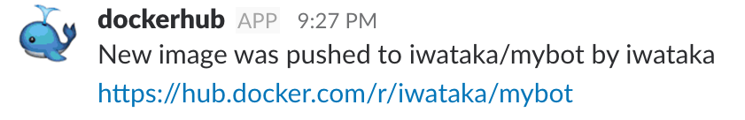

# Dockerhubの自動ビルドの通知をSlackで受けるための一番手軽な方法

`Dockerhub`ではDockerイメージの自動ビルドとそこから`Webhook`機能でPOSTリクエストを送信することができます。
しかし`json`の型が違うので、そのリクエストを直にSlackに送信することはできません。

Dockerイメージのビルドが完了したことをSlackに通知するために色々試行錯誤していましたが、結局`Google Cloud Functions`（もしくは`AWS Lambda`などそれに準ずるもの）を使うのが一番手軽だという結論になりました。

GitHubに変更をプッシュしたら通知を待つだけなので結構便利ですが、あまりやっている人がいないように感じたので紹介したいと思います。

## 設定方法

### Slack Incoming Webhook

1. [Incoming Webhooks](https://slack.com/apps/A0F7XDUAZ-incoming-webhooks)を自分のSlackチームに登録します
2. `Webhook`を1つ作成します。
	* 設定はすべてデフォルトでOKです。ユーザ名やアイコンも後に作成するリクエストに含めることができます。チャンネルだけ好きなものを設定しましょう。

### Google Cloud Functions

1. [Cloud Functions](https://console.cloud.google.com/functions)のページにアクセス
2. `Function`を作成する
3. 以下のプロパティを入力
	* Trigger: HTTP trigger
	* Source code: 下記コード（先程作成した`Webhook`のURLを記述してください）
	* Function to execute: `sendToSlack`

- `index.js`

```js
var request = require('request');

exports.sendToSlack = function sendToSlack(req, res) {
  var slack_endpoint = "<WebhookのURL>";
  var repo_name = req.body.repository.repo_name;
  var pusher = req.body.push_data.pusher;
  var desc = "New image was pushed to " + repo_name + " by " + pusher;
  var repo_url = req.body.repository.repo_url;
  var text = desc + "\n" + repo_url;
  var username = "dockerhub";
  var icon_emoji = ":whale:";

  var post_data = {
    "text": text,
    "username": username,
    "icon_emoji": icon_emoji
  };

  var options = {
    uri: slack_endpoint,
    form: JSON.stringify(post_data)
  }

  request.post(options, function (error, response, body) {
      console.log(body)
      if (!error && response.statusCode == 200) {
        res.status(200).send('Success');
      } else {
        res.status(response.statusCode).send('Fail')
      }
    }
  );
};
```

- `package.json`

```json
{
  "name": "sample-http",
  "version": "0.0.1",
  "dependencies": {
    "request": "2.83.0"
  }
}
```

### Dockerhub

1. `Dockerhub`ページの`Build Settings`より、自動ビルドの設定を実施する
	* https://docs.docker.com/docker-hub/builds/#create-an-automated-build
2. `Webhooks`より、先程作成した`Function`のURLを登録する
	* https://docs.docker.com/docker-hub/webhooks/

## 使い方
ただ変更をプッシュするだけです。
通知が来るのを待ちましょう。
ちなみに上記のコード通りに設定すると以下のようなメッセージがSlackに送信されます。



アイコンはとりあえずクジラの絵文字を使っていますが、もっと`Docker`っぽいものにできるような気がします。
興味のある方は設定を変更してもっと格好よくしてみてください。

`Google Cloud Fucntions`についてももっと面白い使い方があると思うので模索して見たいと思います。
